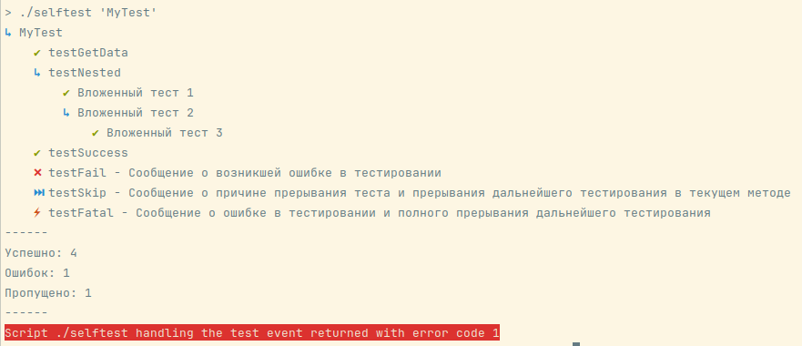

# Микро-фреймворк для модульного тестирования.

[](https://packagist.org/packages/zhivocode/testing)
[](https://github.com/zhivocode/testing/actions/workflows/run-tests.yml)
[](https://packagist.org/packages/zhivocode/testing)

Данный микро-фреймворк для модульного тестирования на языке PHP был разработан с
учетом стремления к элегантности и простоте, вместо того чтобы нагружать пользователей излишними функциями. Этот
микро-фреймворк предоставляет все необходимые инструменты для проведения эффективного и надежного тестирования вашего
кода. Он помогает улучшить качество разрабатываемого программного обеспечения, сократить время тестирования и облегчить
процесс отладки. И он станет незаменимым инструментом для разработчиков, которые ценят простоту и элегантность
в своих тестовых сценариях.

## Установка

Вы можете установить пакет с помощью composer:

```bash
composer require zhivocode/testing
```

## Использование

Инициализация фреймворка:

```php
use Zhivocode\Testing\Engine;

include_once __DIR__ . '/vendor/autoload.php';

$options = array_merge(['filter' => $argv[1] ?? null], getopt('', ['filter:']));

$exitCode = (new Engine())
    ->load(__DIR__ . '/test')
    ->run($options);

exit($exitCode);
```

Пример тестов:

```php
use Zhivocode\Testing\IData;
use Zhivocode\Testing\ITest;

class MyTest 
{
    public function before(IData $data): void
    {
        // Выполняется перед запуском тестов данного класса
        $data->set('foo', 'bar');
    }

    public function after(IData $data): void
    {
        // Выполняется после завершения тестов данного класса
        $data->unset('foo');
    }

    public function beforeEach(IData $data): void
    {
        // Выполняется перед запуском каждого теста данного класса
        $data->set('baz', 'bat');
    }

    public function afterEach(IData $data): void
    {
        // Выполняется после завершения каждого теста данного класса
        $data->unset('baz');
    }

    public function testGetData(ITest $test, IData $data): void
    {
        $data->get('foo'); // Получение раннее заданных данных
    }

    public function testNested(ITest $test, IData $data): void
    {
        $test->test(
            'Вложенный тест 1',
            function (ITest $test, IData $data) {
                // Можно выстраивать многоуровневое тестирование
            }
        );

        $test->test(
            'Вложенный тест 2',
            function (ITest $test, IData $data) {
                $test->test(
                    'Вложенный тест 3',
                    function (ITest $test, IData $data) {
                        // Уровень вложенности тестов не ограничен
                    }
                );
            }
        );
    }

    public function testSuccess(ITest $test, IData $data): void
    {
        // Если метод не меняет состояние $test, такой тест считается успешно завершенным
    }

    public function testFail(ITest $test, IData $data): void
    {
        $test->fail('Сообщение о возникшей ошибке в тестировании');
    }

    public function testSkip(ITest $test, IData $data): void
    {
        $test->skip('Сообщение о причине прерывания теста и прерывания дальнейшего тестирования в текущем методе');
    }

    public function testFatal(ITest $test, IData $data): void
    {
        $test->fatal('Сообщение о ошибке в тестировании и полного прерывания дальнейшего тестирования');
    }
}
```

Запуск тестов:

```bash
php ./test.php
```

Запуск тестов с фильтром конкретного класса тестирования:

```bash
php ./test.php --filter MyTest
```

Запуск тестов с фильтром конкретного метода класса тестирования:

```bash
php ./test.php --filter MyTest::testSuccess
```

Запуск тестов с фильтром вложенного теста конкретного метода класса тестирования:

```bash
php ./test.php --filter "MyTest::testNested::Вложенный тест 2"
```

Пример отчета теста:



## Журнал изменений

Пожалуйста, смотрите [Журнал изменений](CHANGELOG.md) для получения дополнительной информации о том, что изменилось в
последнее время.

## Участи в проекте

Пожалуйста, смотрите [Участие](CONTRIBUTING.md) для получения подробной информации.

## Участники

- [Seytumerov Mustafa](https://github.com/zhivocode)
- [All Contributors](../../contributors)

## Лицензия

Лицензия Массачусетского технологического института (MIT). Пожалуйста, смотрите [Файл лицензии](LICENSE.md) для
получения дополнительной информации.
